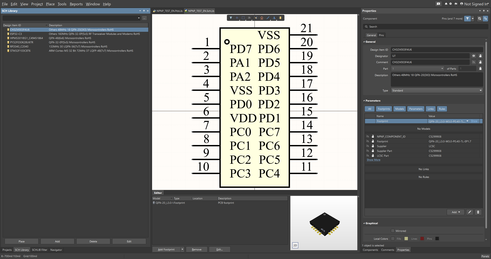
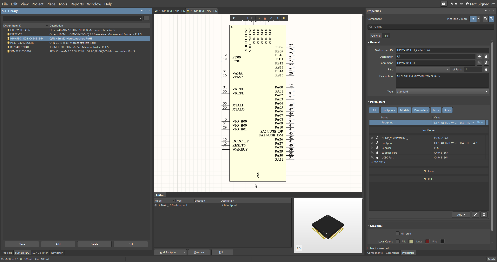
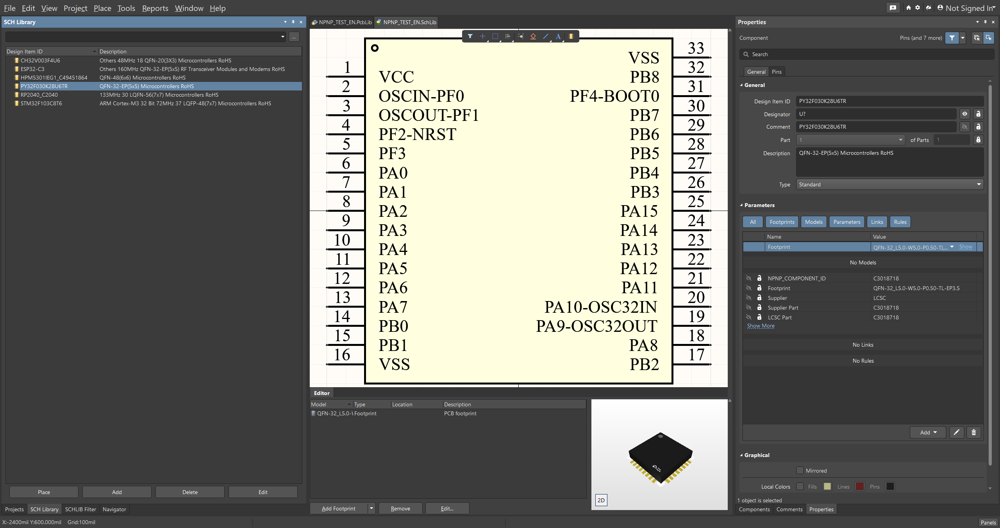
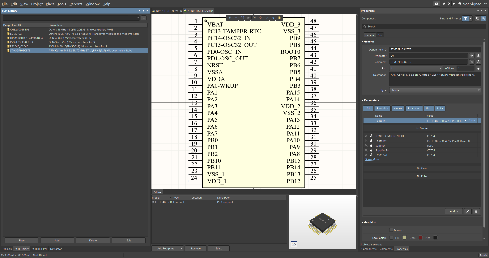
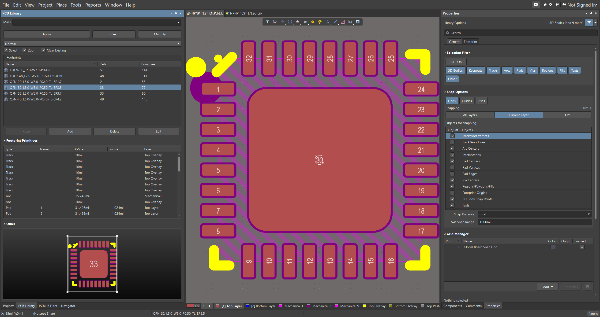

# npnp

<p align="center">
  
</p>

<p align="center">
  <a href="Cargo.toml"></a>
  <a href="LICENSE-APACHE"></a>
  <a href=".github/workflows/windows-release.yml"></a>
  <a href="https://www.rust-lang.org/"></a>
</p>

Normalize Pin Net Pad (`npnp`) is an LCEDA/EasyEDA downloader and Altium library exporter written in pure Rust.

`npnp` searches LCEDA/LCSC components, downloads upstream EasyEDA source data and 3D models, and exports Altium-compatible schematic and PCB footprint libraries.

## Project status

### Implemented

- [x] Search LCEDA/LCSC components by keyword, part name, or LCSC ID.
- [x] Download 3D models as STEP or OBJ/MTL.
- [x] Export raw EasyEDA symbol and footprint JSON for inspection.
- [x] Export Altium schematic libraries (`.SchLib`).
- [x] Export Altium PCB footprint libraries (`.PcbLib`).
- [x] Embed STEP models into PCB libraries when upstream STEP data is available.
- [x] Batch export many LCSC IDs from a text file.
- [x] Export either one file per component or merged library pairs.
- [x] Append new components into an existing merged library pair without duplicating existing LCSC IDs.
- [x] Export optional English metadata from LCSC with `--lcsc-english`.

### Roadmap

- [ ] Remove logo/watermark geometry from downloaded 3D models when possible.
- [ ] Improve solder mask handling for irregular pads during `.PcbLib` export.
- [ ] Add more regression fixtures for unusual EasyEDA symbols and footprints.
- [ ] Improve documentation for batch merge and append workflows.

### Known limits

- Generated libraries should still be visually checked before fabrication.
- Some upstream EasyEDA symbols and footprints may use primitives that need special handling.

Schematic library screenshots:

<p align="center">
  
  
  
  
  
  
</p>

PCB library screenshots:

<p align="center">
  
  
  
  
  
  
</p>

## Pull requests

Pull requests are welcome.

- Chinese and English are both welcome in issues and pull requests.
- Please keep changes focused and explain what problem the PR solves.
- For exporter changes, include the LCSC ID or fixture used for testing when possible.
- If the change affects generated `.SchLib` or `.PcbLib` output, please visually check the result before submitting.
- For larger changes, opening an issue first is recommended so the scope can be discussed.

## How to use the CLI tool

In fact, just type `npnp` in terminal, and then `copy` some reay to use command lines to execute as follows.

Generally speaking, all you need to copy is the last two lines, which could export `shclib` and `pcblib` in batch to a taget output directory and also could append new components to the existing `libs` generated by `npnp`.

```bash
~ → npnp
Normalize Pin Net Pad (npnp) - Pure Rust LCEDA downloader and bundle exporter

Usage: npnp [OPTIONS] [COMMAND]

Commands:
  search         Search components by keyword
  download-step  Search by keyword and download STEP by result index
  download-obj   Search by keyword and download OBJ/MTL by result index
  export-source  Export EasyEDA symbol / footprint JSON sources only
  export-schlib  Export a pure Rust Altium schematic library (.SchLib)
  export-pcblib  Export a pure Rust Altium PCB footprint library (.PcbLib)
  bundle         Export a pure-Rust input bundle: sources + STEP + manifest
  batch          Batch export Altium libraries from a text file of LCSC IDs
  help           Print this message or the help of the given subcommand(s)

Options:
      --prompt   Show ready-to-run example commands
  -h, --help     Print help
  -V, --version  Print version

```

```bash
~ → npnp --prompt
Normalize Pin Net Pad (npnp) ready-to-run commands:

Search a component
  npnp search C2040 --limit 5

Export one schematic library
  npnp export-schlib C2040 --index 1 --output schlib --force

Export one PCB library
  npnp export-pcblib C2040 --index 1 --output pcblib --force

Export EasyEDA source JSON plus STEP bundle
  npnp bundle C2040 --index 1 --output bundle --force

Batch export both libraries from ids.txt
  npnp batch --input ids.txt --output generated\quick_check --full --force --continue-on-error

Merge both libraries into one pair of outputs
  npnp batch --input ids.txt --output generated\merged --merge --library-name MyLib --full --continue-on-error

Append new parts into an existing merged library
  npnp batch --input new_ids.txt --output generated\merged --merge --append --library-name MyLib --full --continue-on-error
```
## How to use the GUI tool

Another easy way is to use [`SeEx`](https://github.com/linkyourbin/seex). And it is STRONGLY recommended. ENJOY, 😊.

I also made a showcase video on bilibili if you dont know how to use `SeEx`: [【工具分享】你应该把时间花费在电路设计和Layout上，而不是机械重复的绘制原理图和封装。](https://www.bilibili.com/video/BV1bEEE6mEHd)
